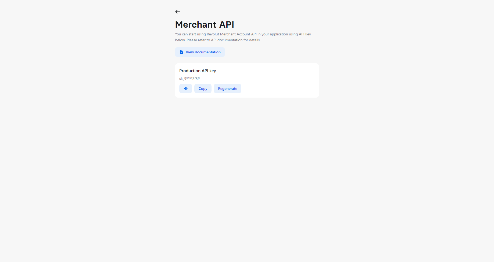

# Customer management API guide

## About customer management

As a Revolut Business customer, you can use [Merchant API](https://developer.revolut.com/docs/api-reference/merchant/) to accept online payments and  manage orders and customers.

## In this guide

You'll use the [Revolut Business Sandbox](https://sandbox-business.revolut.com/signin) environment to perform a few customer management operations using Merchant API:

1. [Authenticate](#authenticate-to-the-sandbox).
2. [Create a new customer](#create-a-customer).
3. [Retrieve the customer](#retrieve-the-new-customer).
4. [Update the customer](#update-the-customer).
5. [Delete the customer](#delete-the-customer).

## Before you start

### Set up your sandbox account

Make sure you have an active Revolut Business Sandbox account. If not, [sign up for one](https://sandbox-business.revolut.com/signup)).

### Authenticate to the sandbox

1. Log in to your [Revolut Business Sandbox portal](https://sandbox-business.revolut.com/signin).
2. In the top left corner, select your account name and, next, click **Merchant API**.
3. From the **Production API key** field, copy the API key provided.

   

***RESULT***

You have your API key, which needs to be used as a value of the `Authorization` header of requests on your server side.

### Identify a domain for endpoints

Set the domain for your sandbox API calls to `sandbox-merchant.revolut.com/`.

## Create a customer

With your API key and domain, you can proceed to creating a new customer.

Navigate to the [Create a customer API](https://developer.revolut.com/docs/api-reference/merchant/#tag/Customers/operation/createCustomer) reference for details on what is required to make a call for adding a customer.

1. Identify the following:

   * HTTP request method to be used (`POST`)
   * `customer` endpoint string (`https://sandbox-merchant.revolut.com/api/1.0/customers`).
   * Request body parameters (all strings):

     * `full_name`
     * `email`

2. In your terminal, enter the request with the parameters and the headers properly configured. Execute it.

```shell
curl --request POST 'https://sandbox-merchant.revolut.com/api/1.0/customers' \
--header 'Authorization: Bearer {enter-api-key-here}' \
--header 'Content-Type: application/json' \
--data-raw '{
    "full_name": "John Doe",
    "email": "john@doe.com"
}'
```

***EXPECTED RESPONSE***

You are returned with JSON including multiple parameters of the newly-created customer.

#### Example response body

```json
{
  "id": "6c7c97a8-cfc1-4cf3-8b38-26a74fdf1fae",
  "full_name": "John Doe",
  "email": "john@doe.com",
  "created_at": "2022-07-03T12:53:19.979397Z",
  "updated_at": "2022-07-03T12:53:19.979397Z"
}
```

***RESULT***

Your new customer is visible in your [Revolut Business Sandbox portal](https://sandbox-business.revolut.com/signin).

## Retrieve the new customer

Navigate to the [Retrieve a customer API](https://developer.revolut.com/docs/api-reference/merchant/#tag/Customers/operation/retrieveCustomer) reference for details on what is required to make a call for retrieving your newly-created customer.

1. Identify the following:

   * HTTP request method to be used (`GET`)
   * `customer` endpoint string (`https://sandbox-merchant.revolut.com/api/1.0/customers/{customer_id}`).
   * Path parameter required (string): `customer_id`

2. In your terminal, enter the request with the parameter and the header properly configured. Execute it.

```shell
curl --request GET 'https://sandbox-merchant.revolut.com/api/1.0/customers/{enter-customer_id-here}' \
--header 'Authorization: Bearer {enter-api-key-here}'
```

***EXPECTED RESPONSE***

You are returned with JSON including multiple parameters of the called customer.

#### Example response body

```json
{
  "id": "6c7c97a8-cfc1-4cf3-8b38-26a74fdf1fae",
  "full_name": "John Doe",
  "email": "john@doe.com",
  "created_at": "2022-07-03T12:53:19.979397Z",
  "updated_at": "2022-07-03T12:53:19.979397Z"
}
```

***RESULT***

You verified that your new customer had been created properly.

## Update the customer

Navigate to the [Update a customer API](https://developer.revolut.com/docs/api-reference/merchant/#tag/Customers/operation/updateCustomer) reference for details on what is required to make a call for updating your customer to

* Set the value of `full_name` to `John Smith`.
* Add `business_name` and set its value to `Revolut`.

1. Identify the following:

   * HTTP request method to be used (`PATCH`)
   * `customer` endpoint string (`https://sandbox-merchant.revolut.com/api/1.0/customers/{customer_id}`).
   * Path parameter required (string): `customer_id`
   * Request body parameters (all strings):

     ```json
     {
       "full_name": "John Smith",
       "business_name": "Revolut",
     }
     ```

2. In your terminal, enter the request with the parameters and the headers properly configured. Execute it.

```shell
curl --request PATCH 'https://sandbox-merchant.revolut.com/api/1.0/customers/{enter-customer_id-here}' \
--header 'Authorization: Bearer {enter-api-key-here}' \
--header 'Content-Type: application/json' \
--data-raw '{
    "full_name": "John Smith",
    "business_name": "Revolut"
}'
```

***EXPECTED RESPONSE***

You are returned with JSON including multiple parameters of the updated customer.

#### Example response body

```json
{
  "id": "6c7c97a8-cfc1-4cf3-8b38-26a74fdf1fae",
  "full_name": "John Smith",
  "business_name": "Revolut",
  "email": "john@doe.com",
  "created_at": "2022-07-03T12:53:19.979397Z",
  "updated_at": "2022-07-03T12:53:19.979397Z"
}
```

***RESULT***

Your customer's second name has been updated and he has a business name now.

## Delete the customer

Optionally you can delete your customer. For details on what is required to make a call for deleting your a customer, navigate to the [Delete a customer API](https://developer.revolut.com/docs/api-reference/merchant/#tag/Customers/operation/deleteCustomer) reference.

1. Identify the following:

   * HTTP request method to be used (`DELETE`)
   * `customer` endpoint string (`https://sandbox-merchant.revolut.com/api/1.0/customers/{customer_id}`).
   * Path parameter required (string): `customer_id`

2. In your terminal, enter the request with the parameter and the header properly configured. Execute it.

```shell
curl --request DELETE 'https://sandbox-merchant.revolut.com/api/1.0/customers/{enter-customer_id-here}' \
--header 'Authorization: Bearer {enter-api-key-here}'
```

***EXPECTED RESPONSE***

If your customer has been identified and deleted, you get no response. If your customer has not been found, you are returned the following response:

```json
{
"errorId": "string",
"timestamp": 0
}
```

***RESULT***

Your customer has been deleted and is no longer available in your [Revolut Business Sandbox portal](https://sandbox-business.revolut.com/signin).
